# INFORME DE AVANCE - PROYECTO DE GRADO
**Sistema de Autenticación Continua mediante Aprendizaje Federado**

**Estudiantes:**
- Bruno Antonio Monzon
- Juan Manuel Rua Echalar 
*(Carrera de Ing. Ciencias de la Computación)*

repositorio del proyecto:
https://github.com/ManuelRuaEchalar/backend_autenticacion_continua
https://github.com/ManuelRuaEchalar/app_autenticacion_continua

---

## 1. Tabla de Infraestructura y Servicios (Actualizada)

| Componente | Servicio AWS | Detalle |
|---|---|---|
| **Cómputo principal** | Amazon EC2 (Familia c7) | Amazon Linux 2, corre el Docker container con Flower + API REST |
| **Contenedor** | Docker (multi-stage) | Imagen con Flower Server + API Metrics + FedAvg Aggregation |
| **Servidor FL** | Flower Server (en Docker) | Federated Learning, agregación FedAvg, comunicación gRPC con clientes Android |
| **API de métricas/Info**| FastAPI / Flask (en Docker) | Metrics & Monitoring, expone endpoints REST para la app y metadatos |
| **Balanceador de carga**| Application Load Balancer (ALB) | Punto de entrada único para clientes Android; enruta HTTPS/TLS hacia la EC2 |
| **Seguridad de red** | HTTPS / TLS en ALB | Toda comunicación cliente ↔ servidor cifrada; los clientes no acceden directamente a la EC2 |
| **Base de datos** | Amazon RDS PostgreSQL (db.t3.micro) | Almacena métricas: consumo de batería, RAM, accuracy, número de ronda, timestamps |
| **Almacenamiento** | Amazon S3 | Checkpoints del modelo global, logs de experimentos, resultados CSV, dashboard estático |
| **Registro de imágenes**| Amazon ECR | Repositorio de imágenes Docker; la EC2 hace pull de la imagen actualizada en cada deploy |
| **CI/CD** | GitHub Actions | Pipeline: code push → Docker build → tests & linting → push a ECR → EC2 pull de nueva imagen |
| **Monitoreo** | Amazon CloudWatch | Logs de Docker, alertas de CPU, métricas de latencia por ronda FL, dashboards personalizados |
| **Alertas** | SNS / Email / Slack | Notificaciones ante alarmas de CloudWatch |
| **Clientes FL** | Android Smartphones | Entrenamiento local on-device, envían gradientes/pesos al servidor vía ALB |

> **Nota sobre Infraestructura:** El Application Load Balancer (ALB) utiliza HTTPS/TLS. Por consiguiente, en la aplicación móvil es imperativo configurar el canal gRPC de Flower con soporte TLS (y remover configuraciones de texto plano `usePlaintext()`). Todas las peticiones apuntan al ALB por el puerto 443.

---

## 2. Flujo de una ronda FL

| Paso | Descripción |
|---|---|
| **1** | Clientes Android entrenan localmente con datos de sensores IMU |
| **2** | Envían gradientes/pesos al Flower Server vía ALB (HTTPS/TLS) |
| **3** | Flower Server agrega las actualizaciones con FedAvg |
| **4** | Modelo global actualizado es devuelto a los clientes |
| **5** | Métricas de la ronda se almacenan en RDS PostgreSQL |
| **6** | Checkpoints del modelo y logs se guardan en S3 |

---

## 3. Diagramas de Arquitectura

**Leyenda de Estado:**
- 🟢 **Operativo:** Todos los componentes se encuentran completamente desplegados, funcionales y en producción.

### Arquitectura del Sistema
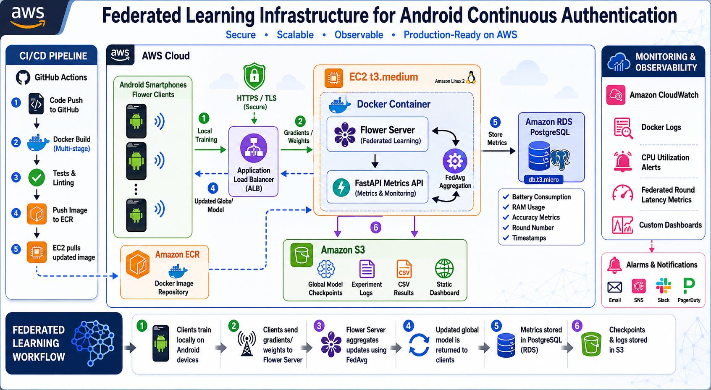

---

## 4. Bitácora de Avance

| Fecha | Actividad | Responsable | Dificultad Superada |
|---|---|---|---|
| **19/05/2026** | Diseño de Arquitectura Clean + MVVM para móvil y selección de framework FL (Flower). | Manuel y Bruno | Toma de decisión sobre cómo unificar la API REST para consultar metadatos del modelo (`startModel.keras`) con el servidor gRPC de Flower en el mismo backend. |
| **22/05/2026** | Implementación del Foreground Service de recolección de sensores en Android e integración local de SQLite (Room). | Manuel | Evitar que el sistema operativo Android mate el servicio de recolección en segundo plano (Doze mode) logrando captura constante a 50Hz. |
| **26/05/2026** | Despliegue de infraestructura base en AWS (Instancia EC2 c7, ALB) y dockerización del backend. | Bruno | Configuración de los Security Groups y resolución del enrutamiento TLS a través del ALB hacia los puertos 5000 y 8080 en los contenedores Docker. |
| **15/06/2026** | Creación y configuración de base de datos relacional RDS PostgreSQL en la nube, y configuración del Bucket S3. | Manuel y Bruno | Creación del esquema inicial para el registro de métricas y correcta configuración de políticas IAM para permitir acceso seguro. |
| **16/06/2026** | Integración del modelo S3 y RDS al contenedor, inicialización automatizada y monitoreo en CloudWatch. | Manuel y Bruno | Inyección segura de credenciales con variables de entorno (`.env`) en Docker y automatización de subida/descarga del checkpoint al S3. |

---

## 5. Comandos Principales y Evidencias de Despliegue AWS
**Responsable:** Bruno Monzon
**Fecha:** 26 de mayo de 2026

### PARTE 1: Recursos en Consola AWS

**1. Creación de Instancia EC2**


**2. Instancia EC2 en Ejecución**
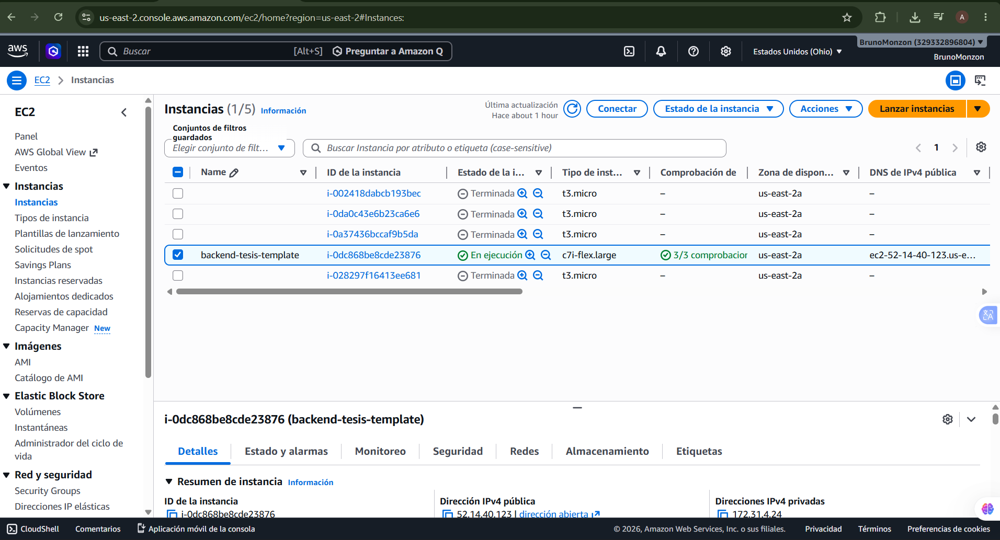

**3. Application Load Balancer Activo**
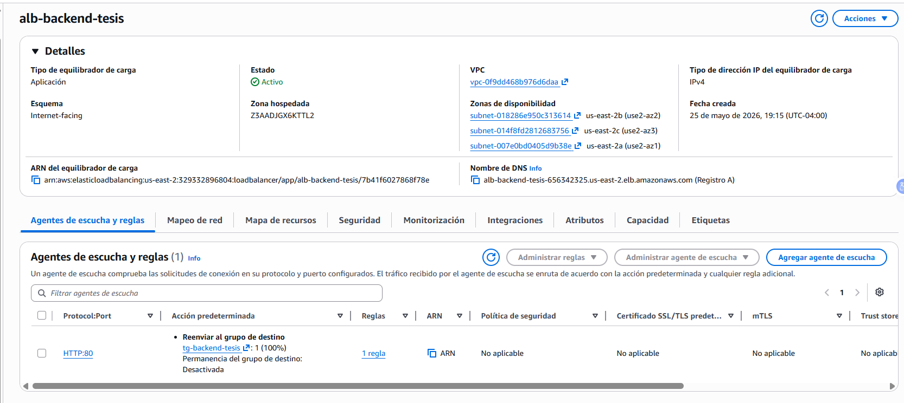

**4. Target Group en Estado Healthy**
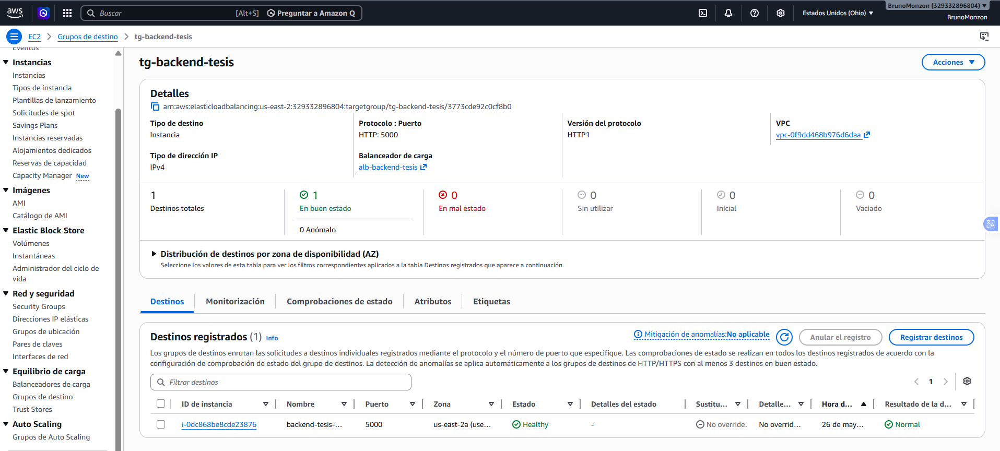

**5. Security Groups Configurados**
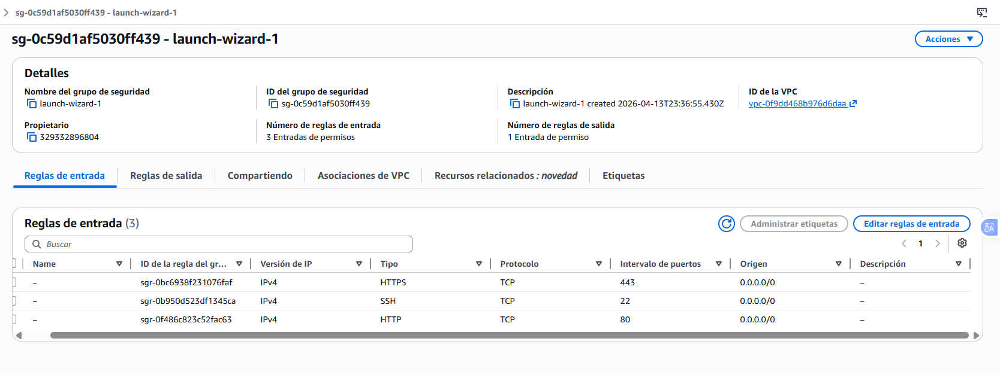

### PARTE 2: Comandos Ejecutados en la Instancia EC2

**1. Ver contenedores en ejecución**
```bash
docker ps
```
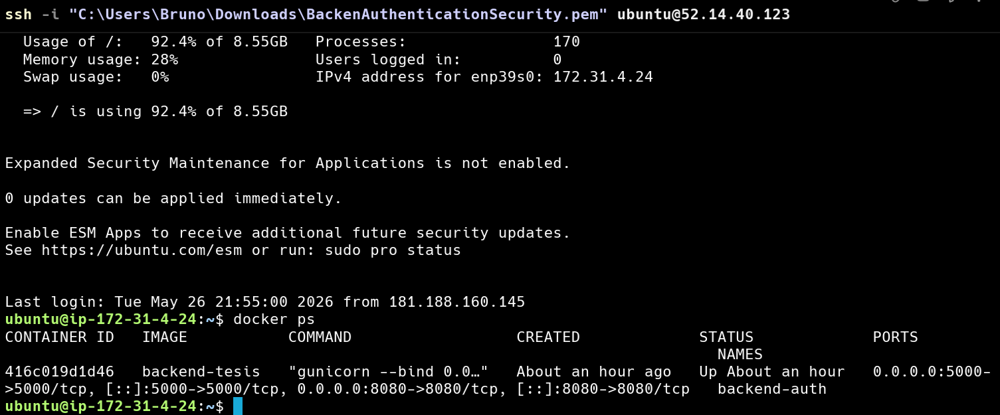

**2. Logs del contenedor**
```bash
docker logs backend-auth --tail 50
```
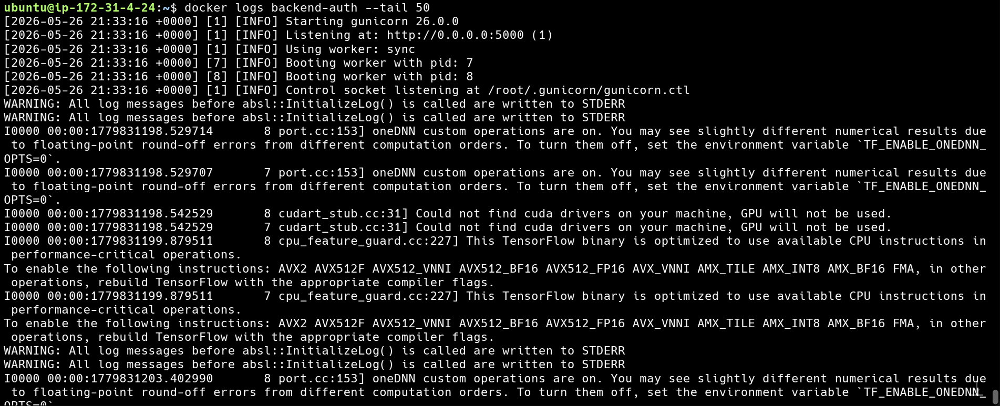

**3. Construir la imagen Docker**
```bash
docker build -t backend-tesis .
```
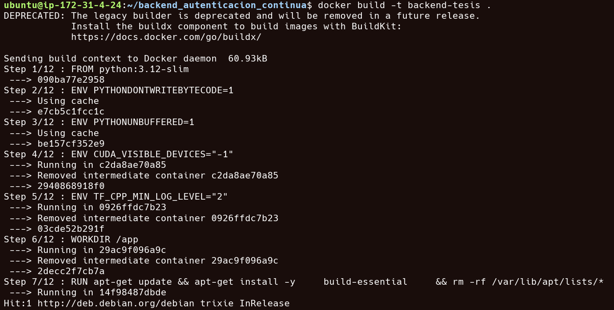

**4. Ejecutar el contenedor**
```bash
docker run -d -p 5000:5000 -p 8080:8080 --name backend-auth --restart unless-stopped backend-tesis
```
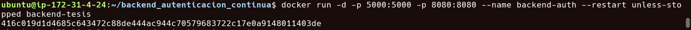

**5. Probar API localmente**
```bash
curl -I http://localhost:5000/api/model/info
```
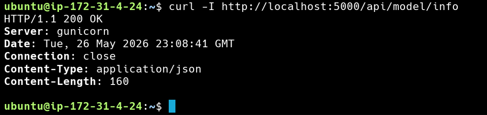

**6. Probar API a través del Load Balancer**
```bash
curl http://alb-backend-tesis-656342325.us-east-2.elb.amazonaws.com/api/model/info
```
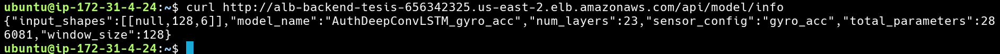

**7. Prueba en Navegador**
Acceso a través del Load Balancer en navegador. URL utilizada: 
`http://alb-backend-tesis-656342325.us-east-2.elb.amazonaws.com/api/model/info`
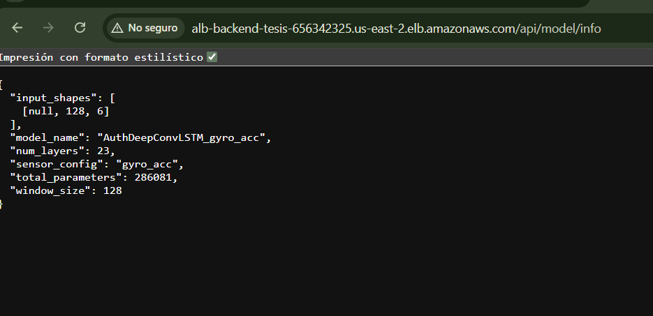

### PARTE 3: Servicios Adicionales Integrados

**1. Base de Datos Amazon RDS (PostgreSQL)**
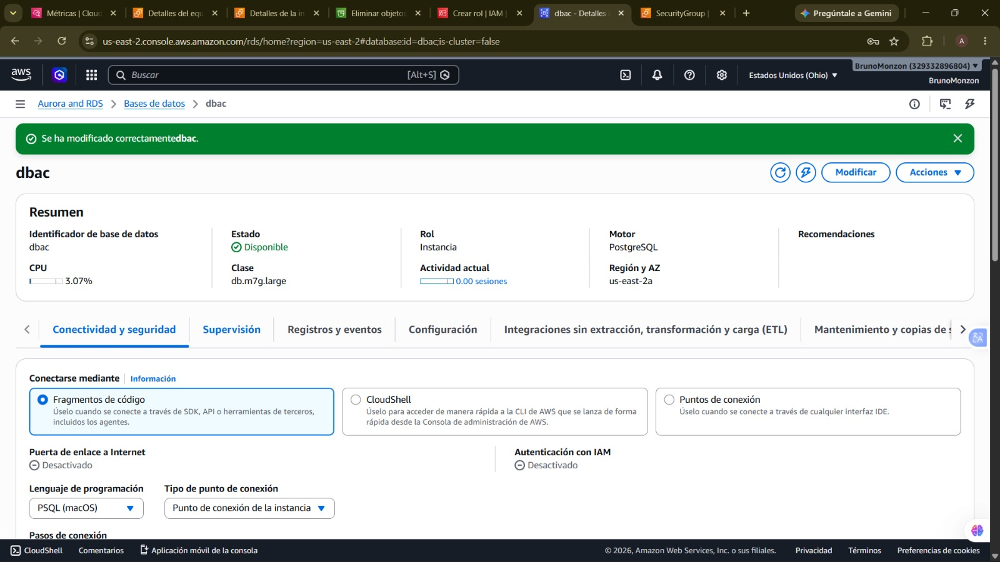

**2. Almacenamiento en Amazon S3**
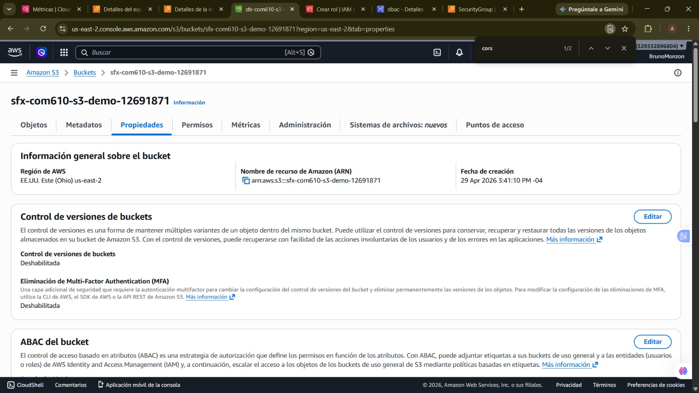

**3. Políticas de Acceso y Roles (IAM)**
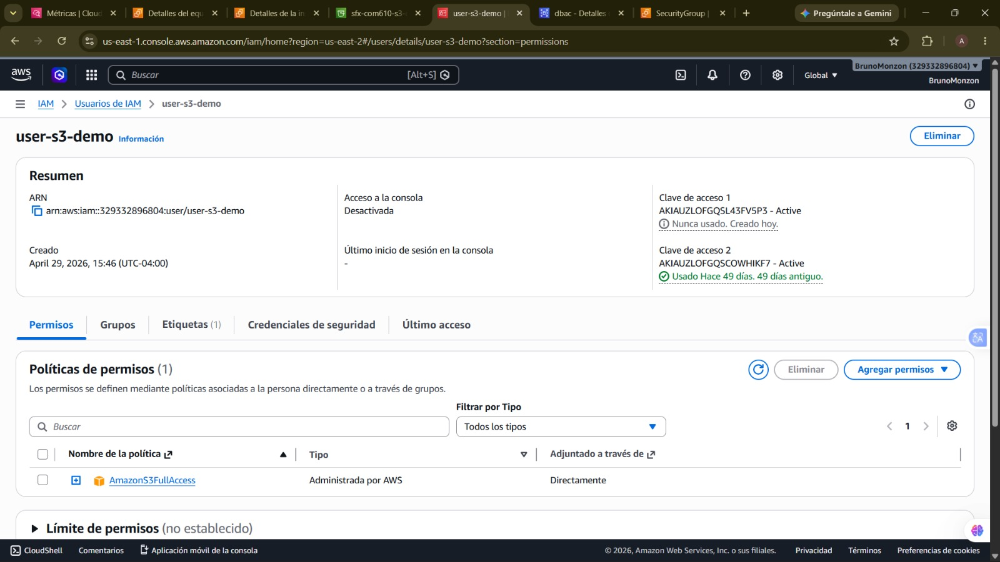

---

## 6. Documentación de Arquitectura Móvil (Autenticación Continua)
**Responsable:** Juan Manuel Rua Echalar

### 6.1 Descripción General
La aplicación "Autenticación Continua" tiene como propósito recolectar de forma invisible (en segundo plano) datos inerciales del dispositivo móvil (acelerómetro y giroscopio) mientras el usuario interactúa con él de forma natural. Su objetivo final es utilizar esta información biométrica conductual para fines de autenticación continua mediante Aprendizaje Federado (Federated Learning).

### 6.2 Arquitectura de Software (Clean Architecture + MVVM)
La aplicación está construida utilizando principios de Clean Architecture y MVVM, garantizando alta cohesión, bajo acoplamiento (SOLID) y alta testabilidad:

- **Capa de Dominio (Domain):** Núcleo de la aplicación. Contiene modelos de negocio (`AccelerometerData`, `GyroscopeData`) y define interfaces para repositorios y sensores.
- **Capa de Datos (Data):** Implementa contratos del dominio. Utiliza "Room" (SQLite) para Base de Datos Local y gestiona la inserción masiva en Corrutinas.
- **Capa de Dispositivo (Device):** Accede al hardware (`SensorManager` a 50Hz) y maneja Receivers de inicio de sistema.
- **Capa de Presentación (Presentation):** Utiliza MVVM con `StateFlow` y Jetpack Compose para interfaces declarativas y reactivas.
- **Capa de Servicios y FL:** Contiene el `DataCollectionService` (Foreground Service) e inyección de dependencias con Koin. **Aquí se integra el cliente de Flower para Aprendizaje Federado.**

### 6.3 Funcionamiento y Flujo de la Aplicación

1. **Inicialización:** La app verifica permisos e inicia el `DataCollectionService`.
2. **Gestión de Sesión:** Detecta uso de pantalla, espera un periodo inicial y pasa a estado `RECORDING` recolectando a 50Hz.
3. **Recolección y Guardado:** Los datos inerciales se insertan masivamente en Room, hasta alcanzar un límite diario preventivo (ej. 15 minutos).
4. **Exportación:** Posibilidad de exportar datos crudos a CSV mediante Storage Access Framework.

### 6.4 Integración de Aprendizaje Federado (Federated Learning)

La app móvil no solo recolecta datos, sino que entrena modelos localmente sin exponer la privacidad del usuario, bajo la siguiente lógica interactuando con la infraestructura AWS:

1. **Verificación de Metadatos:** La app móvil realiza una petición REST (`GET /api/model/info`) al ALB para asegurar que sus parámetros locales (ej. `window_size` de 128) coinciden con los requeridos por el servidor global.
2. **Conexión gRPC Segura:** Se instancia el Cliente de Flower y se conecta vía HTTPS/TLS al Application Load Balancer. *La app se queda a la escucha permanente de instrucciones del servidor.*
3. **Entrenamiento Local (`fit`):**
   - El servidor envía los pesos globales actuales (iniciando con `startModel.keras`).
   - El SDK de Flower en Android recibe los pesos, los inyecta en el modelo TFLite/Keras local y entrena utilizando la base de datos Room.
   - Retorna los nuevos pesos y el conteo de ejemplos utilizados automáticamente al servidor.
4. **Evaluación (`evaluate`):**
   - El servidor distribuye el modelo promediado (FedAvg) y solicita evaluación.
   - El dispositivo evalúa el rendimiento sobre datos locales de prueba, retornando el Loss y el Equal Error Rate (EER) para las métricas globales.
   
Todo el proceso es orquestado transparente por el Flower SDK, requiriendo únicamente que el dispositivo se mantenga con conexión de red.

### 6.5 Principios SOLID Aplicados
- **SRP:** `DataExportServiceImpl` solo exporta a CSV. El cliente FL solo se encarga de la comunicación de pesos.
- **OCP:** Facilidad de agregar el magnetómetro o un nuevo cliente FL sin reescribir `SessionManager`.
- **LSP / ISP / DIP:** Uso estricto de interfaces (`IAccelerometerRepository`, `IFlowerClient`) inyectadas vía Koin, logrando que módulos de alto nivel no dependan de APIs específicas de bajo nivel.
